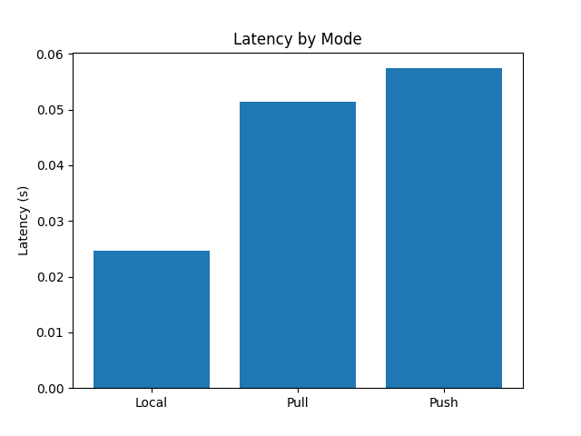
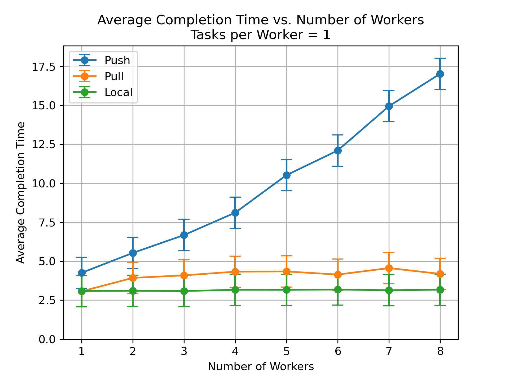
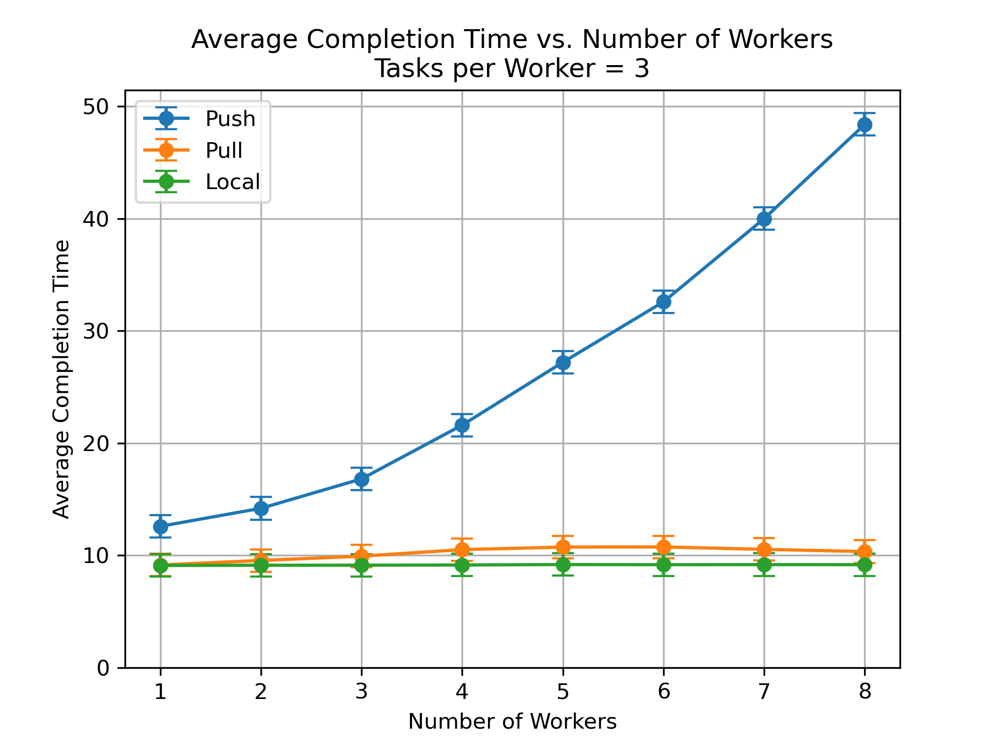

# Performance Report

The performance test of our system focused on two main components: latency and throughput. For each component, one specific function was registered and tested.

## Methodology

**Latency**

In the src/ folder, launch the redis server ('redis-server') and the FaaS service ('uvicorn main:app --reload').

 In a separate terminal, run the latency test ('python3 latency.py'). The latency test will run 10 times and output the average time of each mode to return, as well as generate a bar plot of the latency in ('latency.png'). The latency test was performed by registering a no operation function (noOp) to the Redis server, which should terminate immediately after being sent to a worker. After registering this function, we sent 1 request to the server to execute this function with a specific worker mode (worker count 1) and measured the amount of time it took for the server to respond. This process was repeated 100 times and the average latency was calculated.

**Throughput**

We employed a weak-scaling test to assess the throughput of the service. For each mode and each worker count (1,2,4,8), the test will place a constant number of requests per worker to be executed; the total number of tests increased linearly with worker count. The function executed accepted an integer argument, doubled it, slept for 3 seconds, then returned the result. For each task, we gave a unique argument to ensure all unique tasks were being completed. We measured the total time it took for all tasks to be completed once they were sent by the client.

To run, launch './run_performance.sh [mode] [num workers]'. Results will be saved in 'src/results/[mode]_[num_workers].csv'. This script will compute results for a linear scale rate of 1 task per worker and 3 tasks per worker. 5 trials are run for each. This script was run for all 3 modes and 1,3,5,7 workers. After each runtime, all launched terminal windows must be closed to close the service before running again.

To generate graphs with compute results, run results/performance.ipynb

## Results
**Latency**

*Plot of latency vs. Mode*

As demonstrated in the bar plot, the latecy of the local mode was the lowest of all the worker modes.  The latency of the pull and push mode were comparable, with the pull mode being slightly faster than the push mode. 

**Throughput**

Runtimes can be found in results folder under [mode]_[num workers].csv. The left column indicates runtimes for 1 task per worker, and the right column indicates runtimes for 3 tasks per worker.

*Plot of runtime vs. Worker Count for each Mode, 1 task per Worker*

*Plot of runtime vs. Worker Count for each Mode, 3 task per Worker*

As demonstrated in the plot above, the throughput of the service differed significantly with both the worker count and the mode of worker.

Both the push and pull modes were slower than the local mode, with push mode being the slowest by far of all modes. At all worker counts, this hierarchy of local as fastest and push as slowest was observed.

The throughput decreased (completion time increased) as the number of workers increased for all modes. This decrease was strongest for both remote worker modes, and was weak for the local mode. 

For the greater number of tasks per worker (3), we also note that the increase to runtime relative to increase worker count was greater (slope of line steeper). This held for all modes.

## Discussion
**Latency**

We believe the pull mode had lower latency than the push mode due to the blocking nature of the ZMQ REQ/REP pattern. The dispatcher, after sending the task to the worker, would be blocked until the worker returned its result. Since the latency test was conducted by only one worker, there would be no other worker potentially blocking the dispatcher from receiving the result from the correct pull worker. If the latency test was conducted with additional workers, it is likely latency would increase as workers would poll the dispatcher for tasks and block the working worker from returning its result.

The local mode had the lowest latency as no ZMQ connections were made. Instead, tasks were processed and returned to the Redis server locally, reducing overhead.

The push mode's greater latency was likely a result of the manner in which the dispatcher handled tasks being sent. In the push mode, the dispatcher awaits a message until a specified timeout, then attempts to fetch a task from the queue.

Several approaches could be taken in a future implementation to reduce latency of the pull and push worker modes. As mentioned in the technical report, the ZMQ connection and its limitations served as a limitation in our implementation of each modes. For the pull mode, we required workers to poll the dispatcher for tasks. As the ZMQ REQ/REP pattern is blocking, having multiple workers polling the dispatcher would prevent a worker with a finished result from delivering its result. This may account for latency in the system. 

**Throughput**

The local mode, as the baseline model, was once again the fastest of all modes. This was expected, as the lack of ZMQ connections greatly reduced overhead. In addition, there was no blocking mechanism in the local mode: tasks would be dispatched to the pool as soon as they were received, and there were no additional heartbeat or registration messages that would block the processing and returning of tasks.

The throughput of the service decreased (runtime increased) with worker count for all modes. Since we tested throughput through weak-scaling, the number of total tasks increased linearly with the number of workers and it was expected that each worker would still complete the same number of tasks despite worker count. A greater worker count (and thus greater number of tasks) increased the overhead involved in placing tasks in queue and dispatching them to available workers.

The throughput decreased at a quicker rate relative to worker count when the number of tasks per worker was greater. This is likely due to more total tasks being assigned for the workers to complete, thus increasing the total overhead since more tasks had to be fetched and dispatched.

For both remote modes, a greater number of workers led to more heartbeats being sent. The dispatcher had to manage more of these messages, increasing overhead since receiving these messages would block others from being received.

For the pull mode, a greater number of workers led to more pull workers polling the dispatcher for tasks.

For the push mode, the process of finding an available worker would take longer as the number of workers increased since we cycled through the worker registration to find a free worker. This would partially contribute to the greater overhead in the push mode.

