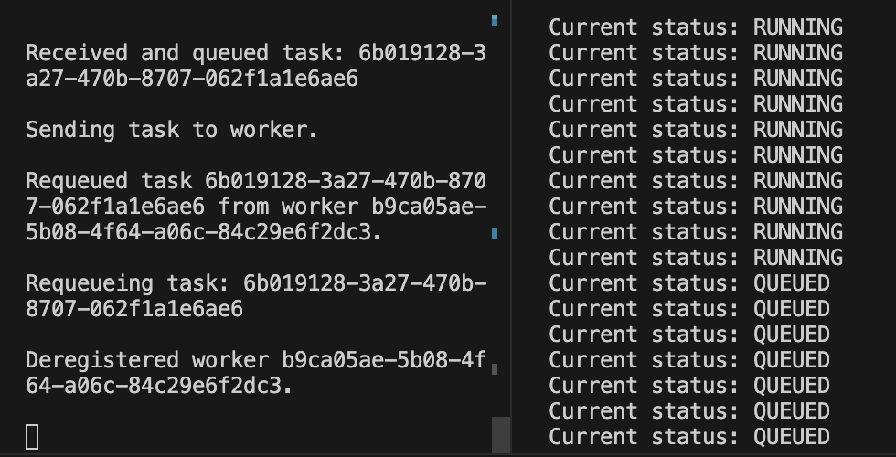
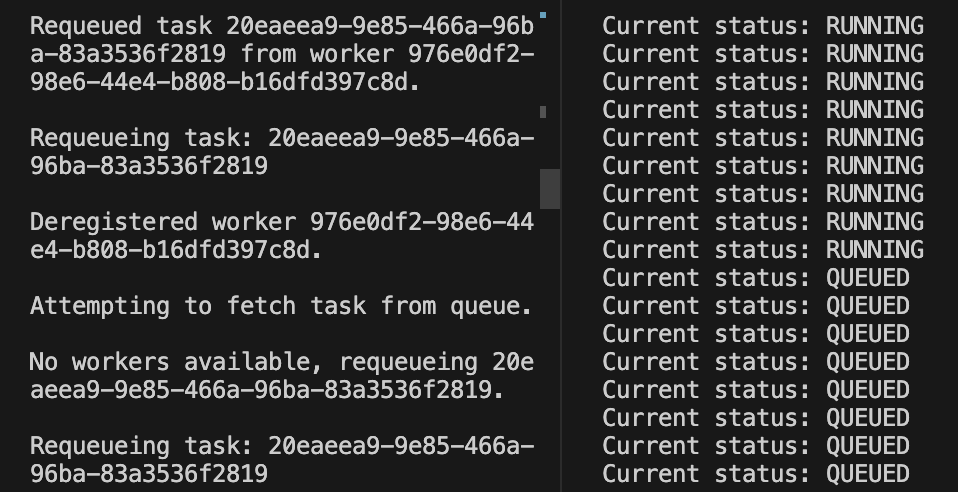
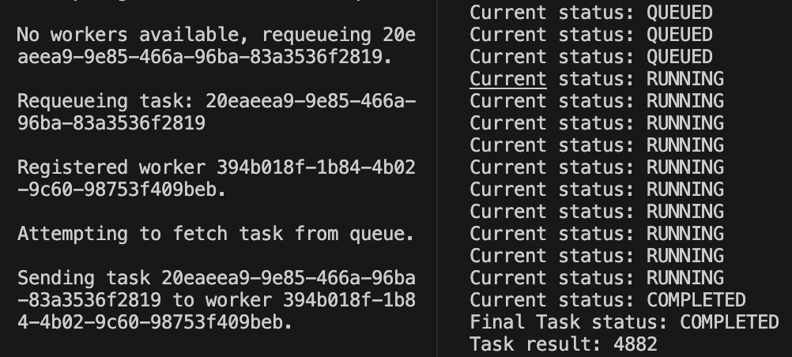

# Testing Report

We tested our Function-as-a-Service (FaaS) platform using the pytest framework on MacOS. There are four main categories of tests: webservice interaction, exection failues, parallel execution, and worker failure. The first three we tested using pytest, and the last we tested manually.

## Testing Automation Script

We wrote a script designed to automate the testing process. The script takes in a worker type (local, pull, or push) as an argument and launches the FaaS platform and the test suite in separate terminal windows. It then waits 3 seconds for the platform to initialize before running the tests. Terminal windows will pop up, and the terminal running pytest should display the test results and print some additional information gathered during the tests.

1. `chmod +x run_tests.sh`
2. Run tests
   1. Local worker: `./run_tests.sh local`
   2. Pull worker: `./run_tests.sh pull`
   3. Push worker: `./run_tests.sh push`
3. The tests will run in one of the new terminal windows. Check the output for the results.

## Web Service Interaction

This test file assesses the platform's function registration and execution capabilities. We use `double(x)` as the example function. Tests are in `test_webservice.py`. The original version of these tests provided by the course staff are in `src/tests/test_webservice_original.py`.

### Functionality Tested

- `test_execute_fn_invalid`: Checks for error when trying to register a non-serialized function
- `test_fn_registration`: Checks that a function can be registered
- `test_execute_fn_invalid`: Checks for error when trying to executed a function with non-serialized parameters
- `test_execute_fn_id_not_found`: Checks for error when trying to execute a function that has not been registered
- `test_execute_fn`: Checks that a function can be executed
- `test_task_id_not_found`: Checks for error when trying to get the status and result of a task that does not exist
- `test_roundtrip`: Checks that a function can be registered, executed, and the result retrieved

## Execution Failures

This test file assesses the platform's ability to handle various error scenarios during function execution. We use `double(x), divide_by_zero(x), multiply(x, y=1), random_integer()` as the example functions Tests are in `src/tests/test_execution_failures.py`.

### Functionality Tested

- `test_too_many_args`: Checks for failure when trying to execute `double(x)` with 2 arguments
- `test_too_little_args`: Checks for failure when trying to execute `double(x)` with 0 arguments
- `test_too_many_kwargs`: Checks for failure when trying to execute `multiply(x, y=1)` with 2 keyword arguments
- `test_wrong_kwargs`: Checks for failure when trying to execute `multiply(x, y=1)` with a keyword argument `z`
- `test_error_in_function`: Checks for failure when trying to execute `divide_by_zero(x)`
- `test_function_import_error`: Checks for failure when trying to use `np.random.randint` when numpy is not imported

## Parallel Execution

This test file focuses on evaluating the platform's ability to execute functions in parallel. We use `multiply(x, y=1)` with a 10 second `time.sleep` as the example function Further tests for performance are documented in `performance_report.md`; these tests just provide a simple baseline to ensure that the platform is capable of parallel execution. Tests are in `src/tests/test_parallel_execution.py`.

### Functionality Tested

Recall that each task should take ~10 seconds to execute, so the total time should be > 10 * (num_tasks / 3) seconds, since there are 3 workers.

- `test_parallel_execution_3`: Checks that 3 tasks can be executed in parallel on 3 workers (~1 per worker)
  - **Total time**
    - Local: 10.36 sec
    - Push: 15.42 sec
    - Pull: 11.37 sec
- `test_parallel_execution_9`: Checks that 9 tasks can be executed in parallel on 3 workers (~3 per worker)
  - **Total time**
    - Local: 30.75 seco
    - Push: 37.98 sec
    - Pull: 31.86 sec
- `test_parallel_execution_15`: Checks that 15 tasks can be executed in parallel on 3 workers (~5 per worker)
  - **Total time**
    - Local: 50.95 sec
    - Push: 59.42 sec
    - Pull: 51.60 sec

## Worker Failure

Finally, we manually tested the platform's ability to handle worker failure for pull and push modes. We start the service, then the workers. We register a task using our client (`src/client.py`, which executes `double(x)` with a 10 second `time.sleep`) and then kill all the workers while the task is running. We see in our task dispatcher terminal that the workers are deregistered after the heartbeat timeout (20 seconds), and the task is re-queued (its status goes from `RUNNING` to `QUEUED`). We then restart the workers, and the task is re-assigned to a worker and executed successfully.

### Pull Mode

After killing the workers, we see that the task is re-queued and the workers are deregistered.

After restarting the workers, we see that the task is re-assigned to a worker and executed successfully.

### Push Mode

After killing the workers, we see that the task is re-queued and the workers are deregistered.

After restarting the workers, we see that the task is re-assigned to a worker and executed successfully.

